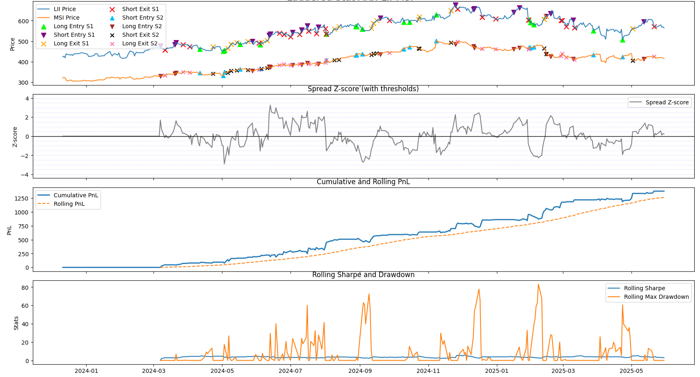

# Statistical Arbitrage: Laddered Pairs Trading Engine

**Author:** Cameron Hayman

> **A robust, fully auditable cointegration-based pairs trading backtest framework. Includes multi-level (laddered) mean-reversion entries, trade-by-trade analytics, detailed logs, and high-quality plots—ready for research or portfolio review.**

---

## Features

- **Automatic S&P 500 Pair Selection:**  
  Finds and tests all possible pairs for statistical cointegration (Engle-Granger method).
- **Laddered Mean-Reversion Entries:**  
  Opens/adjusts trades at configurable rolling z-score intervals (multiple “rungs” per signal).
- **Complete Trade Log:**  
  Every open, close, and forced close (at backtest end) is fully timestamped and auditable.
- **Performance Analytics:**  
  Reports cumulative and rolling PnL, Sharpe ratio, drawdown, and correlation.
- **Multi-Panel Plots:**  
  All buy/sell/close events visualized for both legs; see edge, risk, and regime shifts at a glance.
- **Trade-by-Trade Percent Return Analysis:**  
  (Advanced) Computes round-trip percent return and summary stats for each trade.

---

## Sample Output



---

## Quickstart

```bash
# Clone and run (Python 3.9+ recommended)
pip install numpy pandas matplotlib yfinance statsmodels
python laddered_mean-reversion_strategy.py
